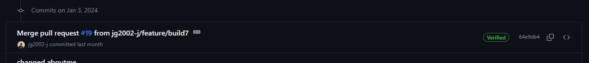
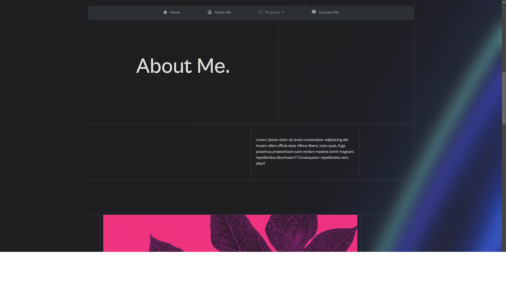

# Bootstrap Portfolio
Challenge Week 3

## IMPORTANT
This repository was forked from an [earlier commit from another of my own repositories](https://github.com/jg2002-j/portfolio-v2/pull/17).
All work is my own, I just wanted to keep both versions of this project for different purposes.
The complete history of this project can be viewed with all the commits here in this repository, and commits 1 to 15 (i.e. earlier than Jan 3, 2024) on my [Portfolio-v2 repo](https://github.com/jg2002-j/portfolio-v2/commits/main/). 

## Built with:

## Description

This challenge involved designing a web page that displayed my work to-date on a page designed with `Bootstrap`, `HTML` and `CSS`.

## Installation

No installation required. Access the deployed GitPages website [here.](https://jg2002-j.github.io/bootstrap-portfolio/)

## Usage

- Browse portfolio as wanted.

## Credits
- Icons at [simpleicons](https://simpleicons.org/) and [shields.io](https://shields.io/)
- Photos by <a href="https://unsplash.com/@martz90?utm_content=creditCopyText&utm_medium=referral&utm_source=unsplash">Martin Martz</a> on <a href="https://unsplash.com/photos/a-blue-and-purple-background-with-wavy-lines-FdxPbyHEw6Y?utm_content=creditCopyText&utm_medium=referral&utm_source=unsplash">Unsplash</a>
- Photo by <a href="https://unsplash.com/@abhi_2410?utm_content=creditCopyText&utm_medium=referral&utm_source=unsplash">Abhishek Tiwari</a> on <a href="https://unsplash.com/photos/qcimj8DMjLE?utm_content=creditCopyText&utm_medium=referral&utm_source=unsplash">Unsplash</a>
- Photo by <a href="https://unsplash.com/@justatony?utm_content=creditCopyText&utm_medium=referral&utm_source=unsplash">Tony Litvyak</a> on <a href="https://unsplash.com/photos/nHMyboz2XI8?utm_content=creditCopyText&utm_medium=referral&utm_source=unsplash">Unsplash</a>
- Photo by <a href="https://unsplash.com/@lazycreekimages?utm_content=creditCopyText&utm_medium=referral&utm_source=unsplash">Michael Dziedzic</a> on <a href="https://unsplash.com/photos/a-close-up-of-a-computer-mother-board-RkAvhhV0Mtk?utm_content=creditCopyText&utm_medium=referral&utm_source=unsplash">Unsplash</a>
- Photo by <a href="https://unsplash.com/@eugene_golovesov?utm_content=creditCopyText&utm_medium=referral&utm_source=unsplash">Eugene Golovesov</a> on <a href="https://unsplash.com/photos/a-close-up-of-a-green-leafy-plant-12-LhcMD2Hg?utm_content=creditCopyText&utm_medium=referral&utm_source=unsplash">Unsplash</a>
- Photo by <a href="https://unsplash.com/@solenfeyissa?utm_content=creditCopyText&utm_medium=referral&utm_source=unsplash">Solen Feyissa</a> on <a href="https://unsplash.com/photos/blue-and-white-water-waves-0m_6xyoaelo?utm_content=creditCopyText&utm_medium=referral&utm_source=unsplash">Unsplash</a>
- Photo by <a href="https://unsplash.com/@allecgomes?utm_content=creditCopyText&utm_medium=referral&utm_source=unsplash">Allec Gomes</a> on <a href="https://unsplash.com/photos/black-and-red-leaf-illustration-Yek0cYh0bnY?utm_content=creditCopyText&utm_medium=referral&utm_source=unsplash">Unsplash</a>
- Navlink animation: adapted from <a href="https://codepen.io/sharkcoder/pen/oNLoddx">@sharkcoder</a>
- Photo by <a href="https://unsplash.com/@dagerotip?utm_content=creditCopyText&utm_medium=referral&utm_source=unsplash">George Dagerotip</a> on <a href="https://unsplash.com/photos/a-close-up-of-a-green-plant-with-lots-of-leaves-qmU9jpj6mCc?utm_content=creditCopyText&utm_medium=referral&utm_source=unsplash">Unsplash</a>
- Photo by <a href="https://unsplash.com/@elijahp?utm_content=creditCopyText&utm_medium=referral&utm_source=unsplash">Elijah Pilchard</a> on <a href="https://unsplash.com/photos/a-close-up-of-a-green-plant-with-leaves-O-EArs-z9hk?utm_content=creditCopyText&utm_medium=referral&utm_source=unsplash">Unsplash</a>
  